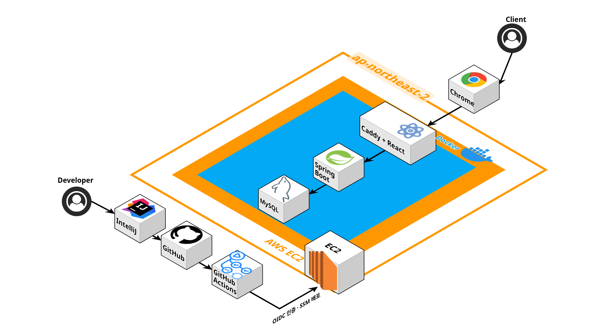

# BuildLog

[실제 홈페이지 바로가기](https://yunjh.kr)

개발자의 프로젝트, 경력, 교육, 자격증, 기술 스택 등 성장 과정을 한곳에 기록하고 보여 주는 개인 포트폴리오 서비스입니다. 방문자는 등록된 정보를 자유롭게 열람할 수 있으며, 관리자는 별도의 관리 화면에서 포트폴리오 콘텐츠를 직접 관리할 수 있습니다.

## ✨ 주요 기능

### 사용자

- 개발자 소개와 연락처 조회
- 프로젝트와 주요 작업 내용 조회
- 경력 및 담당 업무 조회
- 교육 이력과 자격증 조회
- 분야별 기술 스택 조회
- 프로젝트 유형과 기술 스택을 이용한 필터링
- GitHub와 배포 사이트 연결
- 데스크톱 및 모바일 반응형 화면

### 관리자

- JWT 기반 관리자 로그인 및 로그아웃
- Access Token 만료 시 Refresh Token을 이용한 자동 재발급
- 프로필 소개와 연락처 수정
- 프로젝트 등록, 수정, 삭제 및 기술 스택 연결
- 프로젝트별 주요 작업 내용 관리
- 경력과 담당 업무 등록, 수정, 삭제
- 교육 및 자격증 등록, 수정, 삭제
- 기술 스택 등록, 분류 및 삭제

---

## 🛠 기술 스택

| 구분 | 기술 |
| --- | --- |
| Backend |    |
| Frontend |     |
| Data Access |  |
| Database |  |
| Authentication |  |
| Infrastructure |   |
| Server |   |
| CI/CD |   |

---

## 📁 프로젝트 구조

```text
BuildLog
├── frontend
│   └── src
│       ├── features
│       │   ├── career          # 경력
│       │   ├── certification   # 자격증
│       │   ├── education       # 교육
│       │   ├── profile         # 프로필
│       │   ├── project         # 프로젝트
│       │   └── tech-stack      # 기술 스택
│       ├── pages               # 포트폴리오 페이지
│       └── shared              # 공통 API와 컴포넌트
├── src/main/java/com/example/buildlog
│   ├── auth                    # 로그인과 토큰 재발급
│   ├── career                  # 경력
│   ├── certification           # 자격증
│   ├── education               # 교육
│   ├── global                  # 보안, 설정 및 예외 처리
│   ├── profile                 # 프로필
│   ├── project                 # 프로젝트
│   ├── techstack               # 기술 스택
│   └── user                    # 사용자와 관리자 계정
├── project-notes               # 설계 및 학습 문서
├── compose.yaml                # Docker Compose 구성
├── Dockerfile                  # Spring Boot 이미지
└── .github/workflows           # CI/CD 워크플로
```

---

## 🏗 시스템 아키텍처



사용자의 HTTPS 요청은 Caddy로 전달됩니다. Caddy는 React 빌드 결과물을 정적 파일로 제공하고 `/api/*` 요청은 Spring Boot로 전달합니다. Spring Boot는 Spring Data JPA를 통해 MySQL과 통신합니다.

`main` 브랜치에 코드가 반영되면 GitHub Actions가 백엔드 테스트와 프런트엔드 검사·빌드를 수행합니다. 검증이 완료되면 AWS OIDC로 임시 배포 권한을 얻고 Systems Manager를 통해 EC2에서 Docker Compose 서비스를 재배포합니다.

---

## 🔐 JWT 인증 흐름

```text
관리자 로그인
  → Access Token을 응답으로 전달
  → Refresh Token을 HttpOnly 쿠키로 전달
  → Access Token을 Authorization 헤더에 포함해 관리 API 호출
  → 토큰 만료 시 Refresh Token으로 자동 재발급
```

- 공개 조회 API: 인증 없이 접근 가능
- 등록·수정·삭제 API: `ADMIN` 권한 필요
- Access Token: 브라우저 `sessionStorage`에 저장
- Refresh Token: HttpOnly, SameSite 쿠키로 저장

---

## 🚀 CI/CD 흐름

```text
Developer
  → GitHub main push
  → GitHub Actions
      ├── Gradle 백엔드 테스트
      └── 프런트엔드 lint 및 build
  → AWS OIDC 임시 권한 발급
  → AWS Systems Manager 배포 명령
  → EC2에서 Git Pull 및 Docker Compose 재배포
```

AWS Access Key와 SSH 개인 키를 GitHub에 저장하지 않고 OIDC와 Systems Manager를 이용해 배포합니다.

---

## 📚 상세 문서

- [프로젝트 구조와 요청 흐름](project-notes/01-architecture.md)
- [JWT 인증과 인가](project-notes/02-jwt-authentication.md)
- [CI/CD와 운영 배포](project-notes/03-cicd-deployment.md)
- [프로젝트 핵심 학습 내용](project-notes/04-lessons-learned.md)
- [운영 점검표와 개선 과제](project-notes/05-operations-checklist.md)
- [Docker 배포 가이드](DEPLOYMENT.md)

